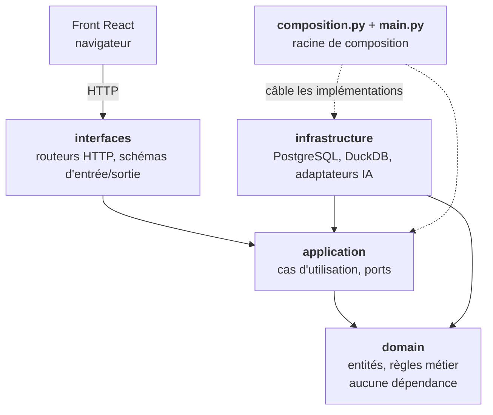
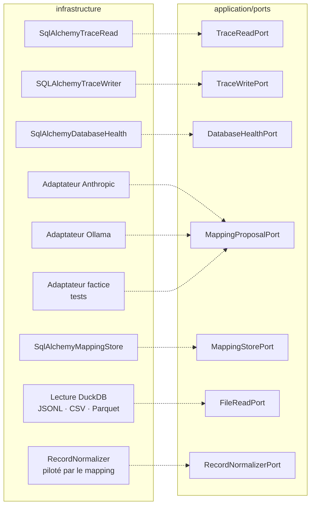
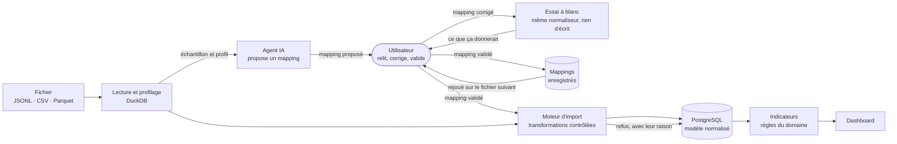

# Architecture d'AgentScope

AgentScope est un **monolithe modulaire** organisé en quatre couches. Ce document décrit
les composants, le sens de leurs dépendances, et ce qui garantit que cette description
reste vraie.

Les décisions qui ont mené à cette structure sont dans [`docs/adr/`](adr/).

## 1. Les couches et le sens des dépendances



**Toutes les flèches pointent vers l'intérieur.** Le domaine ne connaît personne : c'est ce
qui le rend testable sans base, sans serveur et sans appel à un service d'IA.

| Couche | Peut importer | Dépendances externes |
|---|---|---|
| `domain/` | rien | **aucune** — bibliothèque standard uniquement |
| `application/` | `domain` | **aucune** — bibliothèque standard uniquement |
| `infrastructure/` | `domain`, `application` | oui |
| `interfaces/` | `domain`, `application` | oui |
| `composition.py`, `main.py` | tout | oui |

`interfaces/` **n'importe pas** `infrastructure/` : les routeurs reçoivent des cas
d'utilisation déjà câblés, ils ne construisent rien eux-mêmes.

> ### Ce schéma n'est pas déclaratif
>
> La règle ci-dessus est vérifiée par
> [`tests/architecture/test_layer_dependencies.py`](../backend/tests/architecture/test_layer_dependencies.py),
> qui analyse les importations de chaque module et échoue si une frontière est franchie ou
> si une bibliothèque tierce entre dans le cœur métier. Ce test tourne dans la CI : une
> pull request qui contredit ce document est rouge.

## 2. Ports et implémentations

Un **port** est une interface déclarée par la couche application, en fonction de ce dont les
cas d'utilisation ont besoin. Son implémentation vit dans l'infrastructure et est choisie au
câblage. C'est ce qui rend le stockage, la lecture de fichiers et le fournisseur d'IA
remplaçables sans toucher aux règles métier.



| Port | Implémentations | Sélection |
|---|---|---|
| `DatabaseHealthPort` | `SqlAlchemyDatabaseHealth` | câblage |
| `TraceReadPort` | `SqlAlchemyTraceRead` | câblage |
| `TraceWritePort` | `SQLAlchemyTraceWriter` | câblage |
| `MappingStorePort` | `SqlAlchemyMappingStore` | câblage |
| `FileReadPort` | `DuckDBFileReader` | câblage |
| `RecordNormalizerPort` | `RecordNormalizer` | câblage |
| `MappingProposalPort` | Anthropic, Ollama, factice | **`AI_PROVIDER` dans `.env`** |

Le port IA est le seul à se choisir **par configuration** plutôt qu'au câblage, parce que
c'est le seul dont on change en fonctionnement : ni le moteur d'import ni les règles métier
ne bougent quand on passe d'un modèle local à un modèle distant. Aucun identifiant de modèle
n'est écrit en dur.

`RecordNormalizerPort` a une propriété qui vaut d'être dite : **le même normaliseur sert à
l'import et à l'essai à blanc.** Une imitation dédiée à l'aperçu finirait par diverger, et
l'aperçu promettrait un résultat que l'import ne donne pas — exactement ce qu'un aperçu est
censé éviter.

## 3. Le parcours principal



Trois propriétés de ce parcours sont des exigences, pas des choix d'implémentation :

- **L'IA propose, elle n'écrit pas.** Elle ne touche jamais la base, et aucun code produit
  par un modèle n'est exécuté. Le moteur d'import applique des transformations contrôlées à
  partir d'un mapping validé par l'utilisateur.
- **L'utilisateur voit avant de décider.** L'essai à blanc fait tourner le vrai normaliseur
  sur un échantillon et montre les valeurs réellement lues. Sans cette boucle, la seule façon
  de vérifier un mapping serait de lancer l'import et de nettoyer la base ensuite.
- **Les statistiques sont calculées par le programme**, jamais estimées par un modèle.

## 4. Ce qui existe et ce qui reste à construire

| Composant | État |
|---|---|
| Structure en couches, CI, garde-fou d'architecture | **livré** |
| Modèle relationnel, migrations, moteur d'import, déduplication | **livré** |
| Normalisation pilotée par un mapping déclaratif, groupement en sessions | **livré** |
| Agent IA : port, deux fournisseurs réels, adaptateur factice | **livré** |
| Parcours de mapping complet : proposer, corriger, essayer, enregistrer, importer | **livré** |
| Conservation du détail des rejets d'import | **livré** |
| Indicateurs, règles d'agrégation, routes du dashboard | **livré** |
| Dashboard React : indicateurs, graphiques, filtres, qualité, sessions | **livré** |
| Écrans d'import et de mapping | **livré** |

Les limites connues de cette version sont listées dans
[`CHANGELOG.md`](../CHANGELOG.md#limites-connues) — elles portent sur ce que le moteur ne
sait pas encore faire, pas sur des morceaux manquants.

## 5. Deux règles transverses qui contraignent tous les composants

**Une donnée indisponible ne devient jamais un zéro.** Les colonnes de mesure sont nullables
et sans valeur par défaut ; l'absence se propage jusqu'à l'écran, où elle s'affiche comme
absente. Chaque agrégat porte sa couverture réelle. Si l'information est écrasée en base,
aucune règle en aval ne peut la retrouver — c'est pourquoi cette contrainte descend jusqu'au
schéma SQL.

**Les métriques non comparables entre sources sont signalées.** Toutes les sources ne
publient pas les mêmes compteurs : les tokens de création de cache, par exemple, n'existent
que dans les traces Claude. Un indicateur marqué comme propre à une source se signale
automatiquement dès qu'il agrège plusieurs sources.

## 6. Arborescence

```
backend/
  src/agentscope/
    domain/            entités et règles — aucune dépendance
      metrics/         définitions d'indicateurs, agrégation, comparabilité
      mapping/         contrat des champs visés, syntaxe des chemins
      trace/           sessions, appels aux modèles, appels d'outils
    application/       cas d'utilisation et ports — aucune dépendance
      ports/           interfaces attendues de l'infrastructure
      use_cases/       une intention par classe
    infrastructure/    implémentations concrètes
      config/          configuration lue depuis l'environnement
      persistence/     PostgreSQL
      sources/         lecture de fichiers (DuckDB)
      normalization/   application d'un mapping à un enregistrement
      llm/             adaptateurs des fournisseurs d'IA + la question partagée
    interfaces/        API HTTP
    composition.py     le seul endroit qui choisit les implémentations
    main.py            point d'entrée
  alembic/             migrations
  tests/
    architecture/      vérification du sens des dépendances
    fakes/             doublures partagées des ports
frontend/
  src/features/        un dossier par domaine fonctionnel
    dashboard/         indicateurs, graphiques, filtres, qualité, sessions
    import/            téléversement, aperçu, mise au point du mapping, historique
  src/shared/          client HTTP, types d'API dérivés de l'OpenAPI
docs/
  adr/                 décisions d'architecture
```

Le domaine porte aussi `mapping/` : le contrat des champs qu'un mapping peut renseigner, et
la syntaxe des chemins. Le déclarer là — plutôt que dans le routeur ou le normaliseur —
évite qu'il diverge selon l'endroit d'où on le regarde. L'API l'expose, l'interface le lit,
l'agent IA le vise, le moteur l'applique : une seule source.
