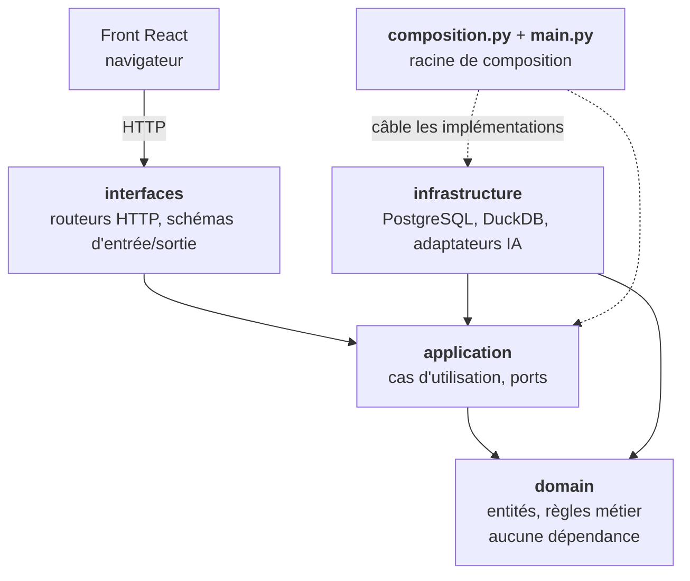
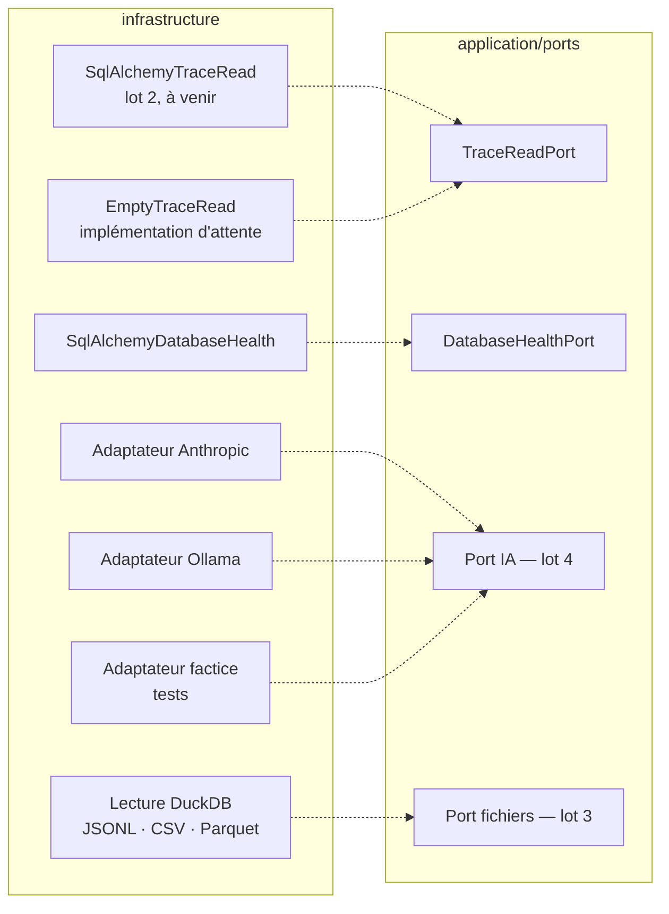
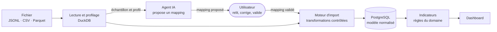

# Architecture d'AgentScope

AgentScope est un **monolithe modulaire** organisé en quatre couches. Ce document décrit
les composants, le sens de leurs dépendances, et ce qui garantit que cette description
reste vraie.

Les décisions qui ont mené à cette structure sont dans [`docs/adr/`](adr/).

## 1. Les couches et le sens des dépendances



**Toutes les flèches pointent vers l'intérieur.** Le domaine ne connaît personne : c'est ce
qui le rend testable sans base, sans serveur et sans appel à un service d'IA.

| Couche | Peut importer | Dépendances externes |
|---|---|---|
| `domain/` | rien | **aucune** — bibliothèque standard uniquement |
| `application/` | `domain` | **aucune** — bibliothèque standard uniquement |
| `infrastructure/` | `domain`, `application` | oui |
| `interfaces/` | `domain`, `application` | oui |
| `composition.py`, `main.py` | tout | oui |

`interfaces/` **n'importe pas** `infrastructure/` : les routeurs reçoivent des cas
d'utilisation déjà câblés, ils ne construisent rien eux-mêmes.

> ### Ce schéma n'est pas déclaratif
>
> La règle ci-dessus est vérifiée par
> [`tests/architecture/test_layer_dependencies.py`](../backend/tests/architecture/test_layer_dependencies.py),
> qui analyse les importations de chaque module et échoue si une frontière est franchie ou
> si une bibliothèque tierce entre dans le cœur métier. Ce test tourne dans la CI : une
> pull request qui contredit ce document est rouge.

## 2. Ports et implémentations

Un **port** est une interface déclarée par la couche application, en fonction de ce dont les
cas d'utilisation ont besoin. Son implémentation vit dans l'infrastructure et est choisie au
câblage. C'est ce qui rend le stockage, la lecture de fichiers et le fournisseur d'IA
remplaçables sans toucher aux règles métier.



| Port | Implémentations | Sélection | Lot |
|---|---|---|---|
| `DatabaseHealthPort` | `SqlAlchemyDatabaseHealth` | câblage | 1 |
| `TraceReadPort` | `EmptyTraceRead` (attente), `SqlAlchemyTraceRead` (à venir) | câblage | 2 et 5 |
| Port IA | Anthropic, Ollama, factice | **`AI_PROVIDER` dans `.env`** | 4 |
| Port fichiers | DuckDB | câblage | 3 |

Le port IA se choisit **par configuration**, sans modifier le code : ni le moteur d'import
ni les règles métier ne changent quand on change de fournisseur ou de modèle. Aucun
identifiant de modèle n'est écrit en dur.

## 3. Le parcours principal



Deux propriétés de ce parcours sont des exigences, pas des choix d'implémentation :

- **L'IA propose, elle n'écrit pas.** Elle ne touche jamais la base, et aucun code produit
  par un modèle n'est exécuté. Le moteur d'import applique des transformations contrôlées à
  partir d'un mapping validé par l'application.
- **Les statistiques sont calculées par le programme**, jamais estimées par un modèle.

## 4. Ce qui existe et ce qui reste à construire

| Composant | État | Lot |
|---|---|---|
| Structure en couches, CI, garde-fou d'architecture | **livré** | 1 |
| Indicateurs, règles d'agrégation, `TraceReadPort` | **livré** | 5 |
| Répartition des outils, série d'activité, détail de session | **livré** | 5 |
| Routes API du dashboard | en cours | 5 |
| Modèle relationnel, migrations, moteur d'import | en cours | 2 |
| Connecteur TraceLab, bilan d'import | en cours | 3 |
| Agent IA et ses adaptateurs | en cours | 4 |
| Dashboard React, écrans d'import et de mapping | à venir | 5 et 6 |

## 5. Deux règles transverses qui contraignent tous les composants

**Une donnée indisponible ne devient jamais un zéro.** Les colonnes de mesure sont nullables
et sans valeur par défaut ; l'absence se propage jusqu'à l'écran, où elle s'affiche comme
absente. Chaque agrégat porte sa couverture réelle. Si l'information est écrasée en base,
aucune règle en aval ne peut la retrouver — c'est pourquoi cette contrainte descend jusqu'au
schéma SQL.

**Les métriques non comparables entre sources sont signalées.** Toutes les sources ne
publient pas les mêmes compteurs : les tokens de création de cache, par exemple, n'existent
que dans les traces Claude. Un indicateur marqué comme propre à une source se signale
automatiquement dès qu'il agrège plusieurs sources.

## 6. Arborescence

```
backend/
  src/agentscope/
    domain/            entités et règles — aucune dépendance
      metrics/         définitions d'indicateurs, agrégation, comparabilité
      trace/           sessions, appels aux modèles, appels d'outils
    application/       cas d'utilisation et ports — aucune dépendance
      ports/           interfaces attendues de l'infrastructure
      use_cases/       une intention par classe
    infrastructure/    implémentations concrètes
      config/          configuration lue depuis l'environnement
      persistence/     PostgreSQL
      sources/         lecture de fichiers (DuckDB)
      llm/             adaptateurs des fournisseurs d'IA
    interfaces/        API HTTP
    composition.py     le seul endroit qui choisit les implémentations
    main.py            point d'entrée
  alembic/             migrations
  tests/
    architecture/      vérification du sens des dépendances
frontend/
  src/features/        un dossier par domaine fonctionnel
  src/shared/          client HTTP, types d'API
docs/
  adr/                 décisions d'architecture
```
